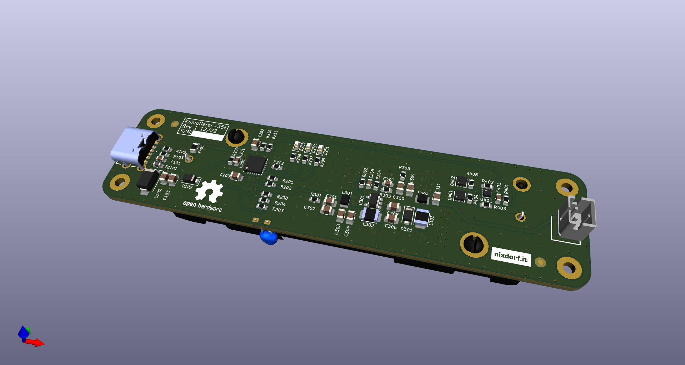
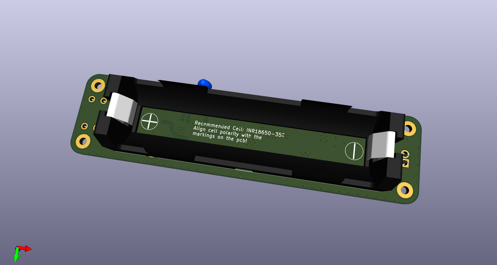

# Kumulierer
## Description
Li-Ion battery charger with basic protection, usb-c input / 2-pin output &amp; power path

## Links
[Aisler Project](https://aisler.net/p/CNVPTRAD)

[BOM](./bom/ibom.html)
